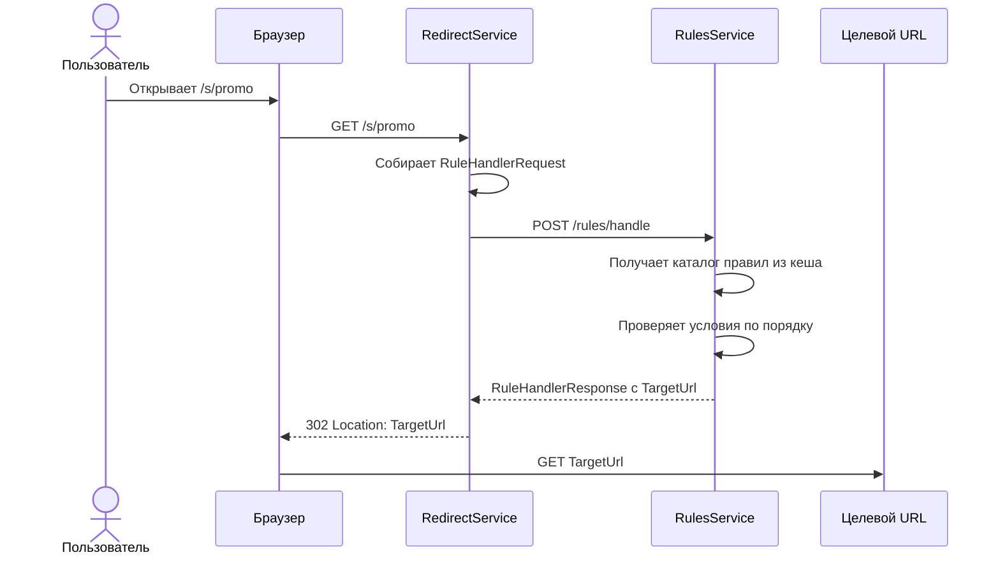
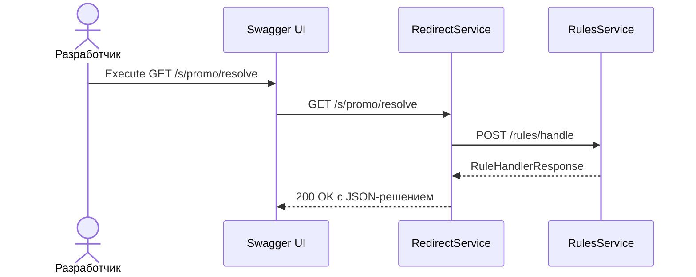
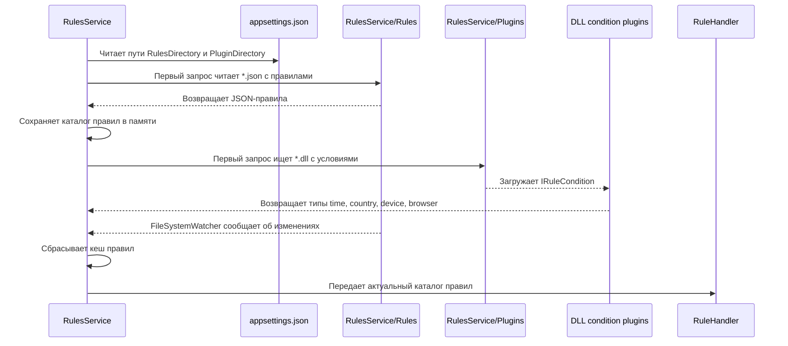
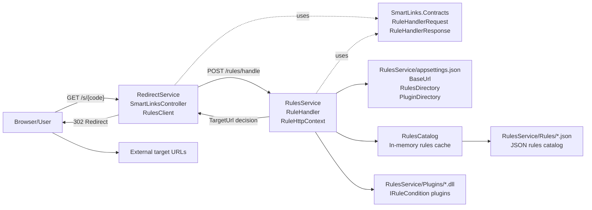
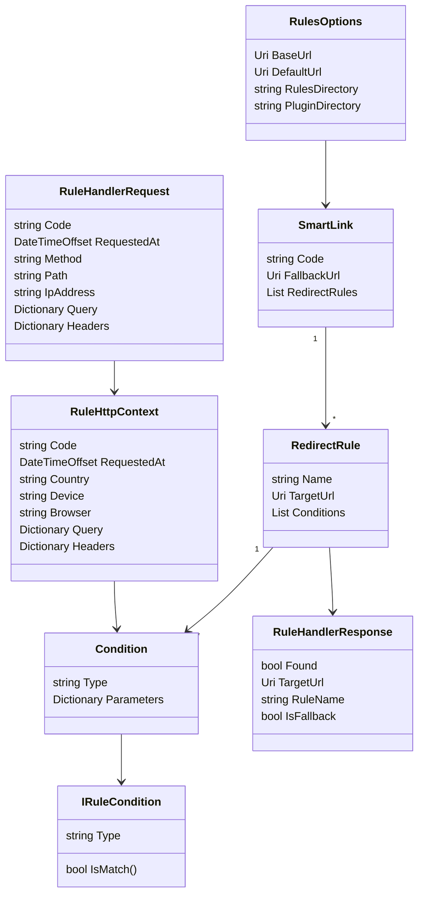

# Архитектурное описание SmartLinks

Документ описывает архитектуру системы умных ссылок: выбранный стиль, бизнес-процессы, функциональные процессы, компоненты, информационную модель, шаблоны проектирования и интеграции.

## Выбранный стиль архитектуры

Для проекта выбран микросервисный стиль архитектуры. Система разделена на два самостоятельных приложения, которые запускаются в Docker Compose:

- `RedirectService` отвечает за публичный HTTP API умных ссылок и выполняет `302 Redirect`.
- `RulesService` отвечает за выбор целевого URL на основе правил.
- `SmartLinks.Contracts` содержит DTO-контракт, общий для обоих сервисов.

Внутри сервисов используется слоистая организация:

- API слой: контроллеры и HTTP endpoints.
- Application/service слой: клиенты интеграции и движок оценки правил.
- Domain/rules слой: условия правил и алгоритм выбора первого совпадения.
- Configuration/plugin слой: JSON DSL, каталог правил в `RulesService/Rules`, кеш правил в памяти и DLL-плагины условий в `RulesService/Plugins`.

Такое разделение позволяет независимо развивать правила редиректа и публичный редирект-сервис.

## Бизнес-процессы

### Переход пользователя по умной ссылке

1. Пользователь открывает короткую ссылку вида `/s/{code}`.
2. `RedirectService` получает HTTP-запрос и собирает снимок запроса: код ссылки, headers, query, IP, путь, метод и время.
3. `RedirectService` отправляет снимок запроса в `RulesService`.
4. `RulesService` находит описание ссылки по `code`.
5. `RulesService` проверяет правила по порядку.
6. Первое совпавшее правило возвращает `TargetUrl`; если URL задан относительным путем, он собирается с `BaseUrl`.
7. `RedirectService` возвращает пользователю `302 Redirect`.

### Fallback при отсутствии совпавшего правила

Если ссылка найдена, но ни одно правило не подошло, используется `FallbackUrl` конкретной ссылки. Если ссылка не найдена, используется глобальный `DefaultUrl`, если он задан. `FallbackUrl`, `DefaultUrl` и `TargetUrl` могут быть абсолютными URL или относительными путями. Относительные пути преобразуются в абсолютные через `BaseUrl` из конфигурации. Если относительный URL не может быть преобразован из-за отсутствующего `BaseUrl`, возвращается `404 Not Found`.

### Добавление новых правил

Новые правила добавляются без изменения кода:

- отдельным JSON-файлом в папку `RulesService/Rules`.

`RulesService` читает JSON-каталог в память и не парсит файлы на каждый запрос. За изменениями в папке `RulesService/Rules` следит `FileSystemWatcher`: при создании, изменении, удалении или переименовании JSON-файла кеш сбрасывается, и следующий запрос получает актуальные правила.

Базовый адрес сайта хранится в `RulesService/appsettings.json` в поле `Rules:BaseUrl`. Поэтому JSON-правила могут содержать переносимые пути вроде `/promo`, `/chrome` или `/ru/morning`, а конкретный домен меняется настройкой окружения.

Условия правил загружаются только из DLL-плагинов в папке `RulesService/Plugins`. Сейчас подключен базовый плагин `RulePlugins.Core` с условиями `time`, `country`, `device` и `browser`. DLL должна ссылаться на `SmartLinks.Contracts` и содержать класс с конструктором без параметров, реализующий `IRuleCondition`. После этого JSON-правило может использовать условие через поле `Type`.

### Проверка решения без редиректа

Для отладки и Swagger используется endpoint `/s/{code}/resolve`. Он вызывает тот же `RulesService`, но возвращает JSON-решение без `302 Redirect`.

## Функциональные процессы

### Основной редирект `/s/{code}`

### Проверка правил без редиректа `/s/{code}/resolve`

### Загрузка JSON-правил и DLL-плагинов условий

## Компонентная схема

## Модели данных

## Используемые шаблоны

- **Спецификация** : каждое условие правила реализует `IRuleCondition`.
- **Цепочка обязанностей** : правила проверяются по порядку до первого совпадения.
- **DI** : зависимости регистрируются через `AddSmartLinks` и `AddRulesEngine`.
- **Options** : настройки читаются через `RulesOptions` и `SmartLinkOptions`.
- **DTO/Contract** : `SmartLinks.Contracts` задает контракт между сервисами.
- **Dynamic Plugin pattern** : DLL-файлы в `RulesService/Plugins` добавляют новые условия без изменения `RulesService`.
- **Cached Repository pattern** : JSON-каталог правил хранится в памяти и перечитывается только после изменений в `RulesService/Rules`.

## Описание интеграций

### RedirectService -> RulesService

- Протокол: HTTP.
- Метод: `POST /rules/handle`.
- Вход: `RuleHandlerRequest`.
- Выход: `RuleHandlerResponse`.
- Docker-адрес внутри Compose: `http://rulesservice:8080`.
- Локальный адрес снаружи Compose: `http://localhost:18081`.

### RedirectService -> Browser

- Endpoint редиректа: `GET /s/{code}`.
- Успешный ответ: `302 Redirect` с заголовком `Location`.
- Endpoint отладки: `GET /s/{code}/resolve`.
- Ответ отладки: `200 OK` с JSON-решением.

### RulesService -> JSON rules/plugins

- `RulesService/appsettings.json` задает `RulesDirectory`, `PluginDirectory`, `BaseUrl` и глобальный `DefaultUrl`.
- Правила читаются из файлов `RulesService/Rules/*.json`.
- JSON-каталог правил кешируется в `RulesCatalog` и перечитывается после изменений в папке `Rules`.
- Относительные `TargetUrl`, `FallbackUrl` и `DefaultUrl` преобразуются в абсолютные URL через `BaseUrl`.
- Типы условий читаются из файлов `RulesService/Plugins/*.dll`.
- DLL-плагины кешируются в `ConditionRegistry`; при изменениях в папке `Plugins` кеш условий сбрасывается.
- В текущей реализации условия `time`, `country`, `device` и `browser` поставляются плагином `RulePlugins.Core`.

### Docker Compose

Система запускается как Compose-проект `smartlinks`.

- `redirectservice` публикуется наружу на `http://localhost:8080`.
- `rulesservice` публикуется наружу на `http://localhost:18081`.
- Между контейнерами используется внутреннее имя `rulesservice` и порт `8080`.
